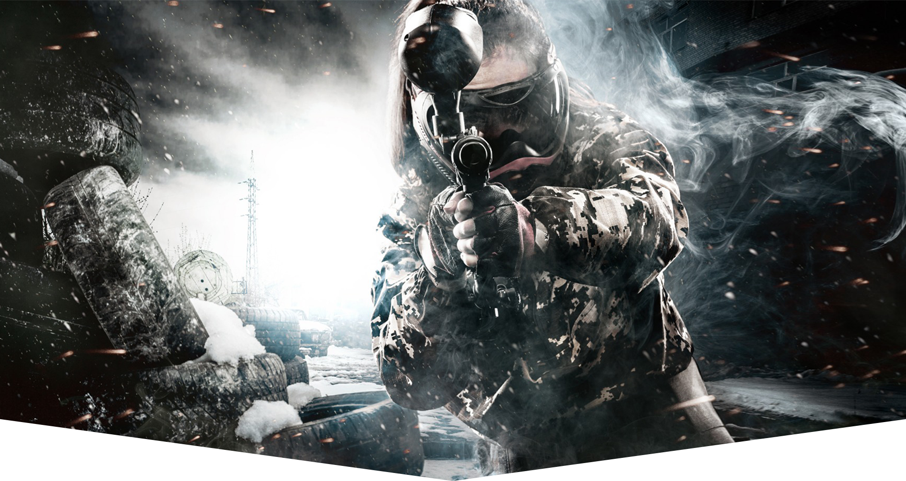
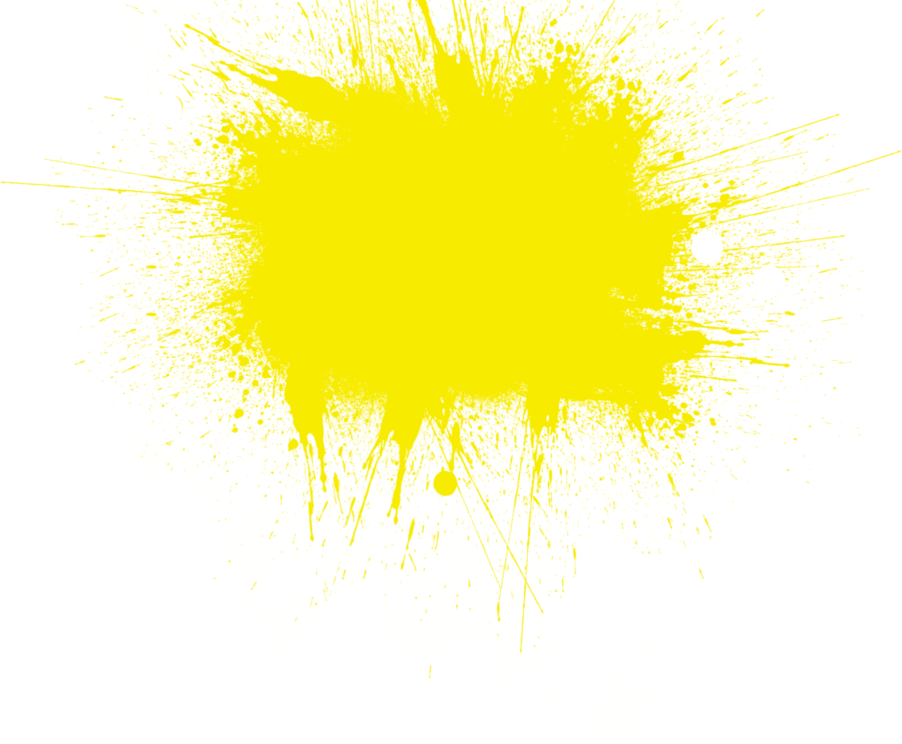

<!doctype html>
<html lang="ru">
<head>
    <meta charset="UTF-8">
    <meta name="viewport"
          content="width=device-width, user-scalable=no, initial-scale=1.0, maximum-scale=1.0, minimum-scale=1.0">
    <meta http-equiv="X-UA-Compatible" content="ie=edge">
    <title>ТИСТРАЛЬ</title>
    <link rel="stylesheet" href="https://stackpath.bootstrapcdn.com/bootstrap/4.3.1/css/bootstrap.min.css" integrity="sha384-ggOyR0iXCbMQv3Xipma34MD+dH/1fQ784/j6cY/iJTQUOhcWr7x9JvoRxT2MZw1T" crossorigin="anonymous">
    <link rel="stylesheet" href="css/main.css">

</head>
<body>

<header>
    
    

        

            

                    

            

        

    

    <section class="top-line">
    

        

            

                
            

            

                <nav class="top-nav">
                    <ul>
                        <li><a href="#">Главная</a></li>
                        <li><a href="#">Площадки</a></li>
                        <li><a href="#">Отзывы</a></li>
                        <li><a href="#">Новости</a></li>
                        <li><a href="#">Контакты</a></li>
                    </ul>
                </nav>
            

            

                <a href="#">+7 (920) 031-11-12</a>
            

        

    

    </section>

    <section class="container" style="position: relative; height: 100%;">
        

            

                

                    

                    

                        

                            <h2>пейнтбол</h2>
                            <h3>Лучше, чем отдых. Больше, чем спорт.</h3>
                            <a href="#" class="btn_order">Заказать игру</a>
                            
                        

                    

                    

                    

            

        

    </section>

    <section class="header__blocks_info">
        

            

                

                

                    
                    <h4>опыт</h4>
                    
Играем в пейнтбол более 7 лет. Для нас это не просто игра, а ритм жизни.

                

            

        

    </section>

</header>

<section class="our_platform">
    

        

            

                <h4>Наши площадки</h4>
            

        

    

</section>

</body>
</html>
